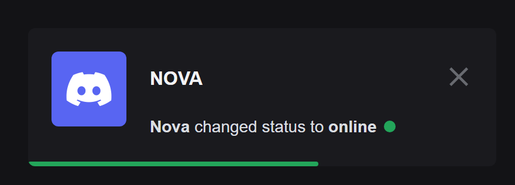
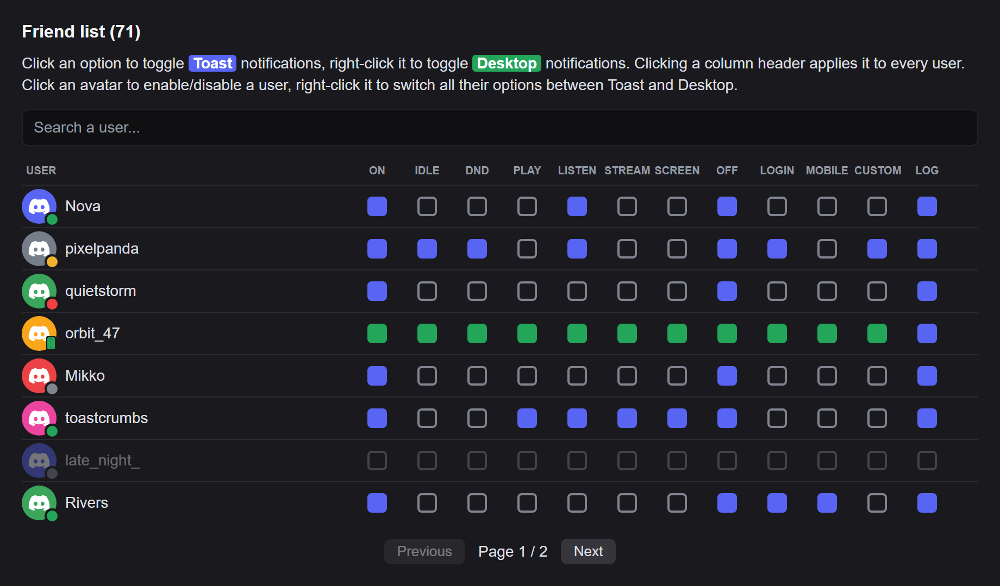
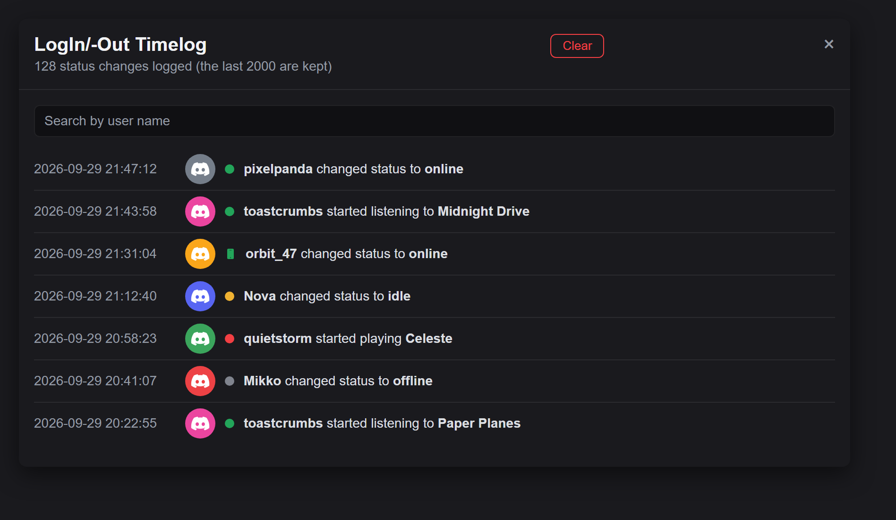

# FriendNotifications (Vencord)

Portage pour **Vencord** du plugin BetterDiscord *FriendNotifications* de DevilBro
(v2.1.6). Affiche une notification quand un ami — ou un utilisateur que vous
choisissez d'observer — change de statut, se met à jouer, écouter, streamer,
partager son écran, ou change son statut personnalisé.



*A status change as it appears in Discord: an in-app toast tinted with the colour
of the new status. Desktop notifications are available too, per user and per event.*



*One setting per user and per event: click for a toast (blue), right-click for a
desktop notification (green). The users shown here are fictitious.*



*The timelog, kept across restarts: timestamp, status and message for every
change, with search and pagination.*

## Fonctionnalités

- Notifications **Toast** (notification Vencord dans l'appli) ou **Desktop**
  (notification système), au choix **par utilisateur et par type d'événement** :
  online, idle, dnd, offline, login, playing, listening, streaming,
  screensharing, mobile, custom.
- **Compteur d'amis en ligne** en haut de la liste des serveurs (cliquer dessus
  ouvre le journal).
- **Journal (timelog)** persistant entre les sessions (2000 dernières entrées,
  stockées dans IndexedDB) avec recherche, pagination et bouton *Clear*.
- **Messages personnalisables** avec les placeholders `$user`, `$nick`,
  `$status`, `$statusOld`, `$custom`, `$game`, `$song`, `$artist`.
- **Sons personnalisés** par type (Toast / Desktop), avec *Mute*.
- **Liste d'amis** synchronisée automatiquement + **inconnus** (strangers)
  ajoutés par ID ou pseudo.
- **Import de la config BetterDiscord** (`FriendNotifications.config.json`) :
  réglages, messages, utilisateurs observés et sons.
- Options : horodatage, silence en DnD, ouverture du DM (ou du salon vocal pour
  un partage d'écran) au clic, intervalle de vérification.

## Installation

Vencord ne charge les plugins tiers qu'à partir d'un build depuis les sources
(`src/userplugins/`). Il faut Node.js ≥ 22, pnpm et git.

```bash
git clone https://github.com/Vendicated/Vencord
cd Vencord
pnpm install --frozen-lockfile
```

Récupérez ensuite le plugin dans `src/userplugins/` (le dossier `userplugins`
est créé au passage) :

```bash
git clone https://github.com/TheUnknownMurda/FriendNotifications-Vencord src/userplugins/friendNotifications
```

(ou copiez ce dossier à la main au même endroit), ce qui donne :

```text
Vencord/
└── src/
    └── userplugins/
        └── friendNotifications/
            ├── index.tsx
            ├── settings.tsx
            ├── ...
            └── styles.css
```

Puis compilez et injectez :

```bash
pnpm build
pnpm inject
```

(`pnpm inject` ne doit être lancé qu'une fois ; ensuite un simple `pnpm build`
+ redémarrage de Discord suffit après une modification ou un `git pull` du
plugin. Si Vencord était déjà installé via l'installeur officiel, `pnpm inject`
remplace cette installation par votre build.)

Activez ensuite **FriendNotifications** dans *Paramètres → Vencord → Plugins*.

## Récupérer votre configuration BetterDiscord

1. Ouvrez les paramètres du plugin, section **Import from BetterDiscord**.
2. Cliquez sur *Import BetterDiscord config…* et choisissez le fichier
   `FriendNotifications.config.json` (dossier `plugins` de BetterDiscord).
3. Si le fichier contient plusieurs comptes, celui qui correspond au compte
   connecté est utilisé (sinon le premier).

Les utilisateurs déjà configurés sont écrasés par ceux du fichier, les autres
sont conservés.

## Différences avec la version BetterDiscord

- **Position et durée des toasts** : ce sont les réglages globaux de Vencord
  (*Paramètres → Vencord → Notifications*) qui s'appliquent (position, durée,
  et « native / dans l'appli »). Les options `toastPosition` / `toastTime` du
  plugin BD n'existent donc plus. Les toasts apparaissent aussi dans le
  *Notification Log* de Vencord.
- **Sons** : les fichiers sont stockés localement (IndexedDB) et joués via des
  URLs `blob:`, car la CSP de Discord bloque les URLs externes. Un lien direct
  ne peut être téléchargé que depuis un hôte autorisé par Discord (par exemple
  une pièce jointe `cdn.discordapp.com`) ; sinon, choisissez un fichier local.
- **Type de notification** : pour les événements *playing / listening /
  streaming / screensharing / custom / login*, c'est la case de cet événement
  qui décide Toast ou Desktop (la version BD utilisait celle du statut de base).
- **Statut personnalisé** : suivi indépendamment de l'activité principale (la
  version BD ne le voyait pas quand l'utilisateur jouait en même temps).
- **Changement de chanson** : notifié même si la personne reste en écoute (la
  version BD ne prévenait qu'au démarrage de l'écoute). Les changements de jeu
  en cours de partie restent silencieux, comme dans la version BD.
- **Clic sur une notification de partage d'écran** : navigue vers le salon
  vocal au lieu de le rejoindre automatiquement.
- **Format de date** : une chaîne de format moment.js (`DD/MM/YYYY HH:mm:ss`)
  remplace le sélecteur de date BDFDB. Vide = format de votre langue.
- **Journal** : conservé entre les redémarrages (la version BD ne gardait que
  la session en cours).
- Le plugin `EditUsers` (noms/avatars modifiés) n'est pas pris en compte.

## Utilisation du tableau des utilisateurs

- Clic sur une case : active / désactive la notification **Toast**.
- Clic droit sur une case : active / désactive la notification **Desktop**.
- Clic (ou clic droit) sur un en-tête de colonne : applique à tous.
- Clic sur l'avatar : active / désactive l'utilisateur.
  Clic droit : bascule toutes ses options entre Toast et Desktop.
- Colonne **Log** : écrire ou non les changements de cet utilisateur dans le
  journal.

## Structure du code

| Fichier                | Rôle                                                       |
| ---------------------- | ---------------------------------------------------------- |
| `index.tsx`            | Déclaration du plugin, compteur d'amis, cycle de vie       |
| `settings.tsx`         | Réglages (`definePluginSettings`)                          |
| `constants.ts`         | Types, valeurs par défaut, libellés                        |
| `observer.ts`          | Boucle de vérification, snapshots, détection des changements |
| `notifications.tsx`    | Envoi des toasts / notifications bureau                    |
| `format.tsx`           | Placeholders, horodatage, noms de statut localisés         |
| `timelog.tsx`          | Journal persistant (IndexedDB) + modale                    |
| `sounds.ts`            | Stockage et lecture des sons                               |
| `UserList.tsx`         | Tableau amis / inconnus / valeurs par défaut               |
| `SettingsSections.tsx` | Sections de la page de réglages                            |
| `importBD.ts`          | Import de la config BetterDiscord                          |
| `styles.css`           | Styles (chargés via `managedStyle`)                        |

## Crédits et licence

Portage Vencord : TheUnknownMurda.
Plugin original : [FriendNotifications](https://github.com/mwittrien/BetterDiscordAddons/tree/master/Plugins/FriendNotifications)
par DevilBro (Mirco Wittrien).

Distribué sous licence [GPL-3.0](LICENSE), comme Vencord et le plugin original.
